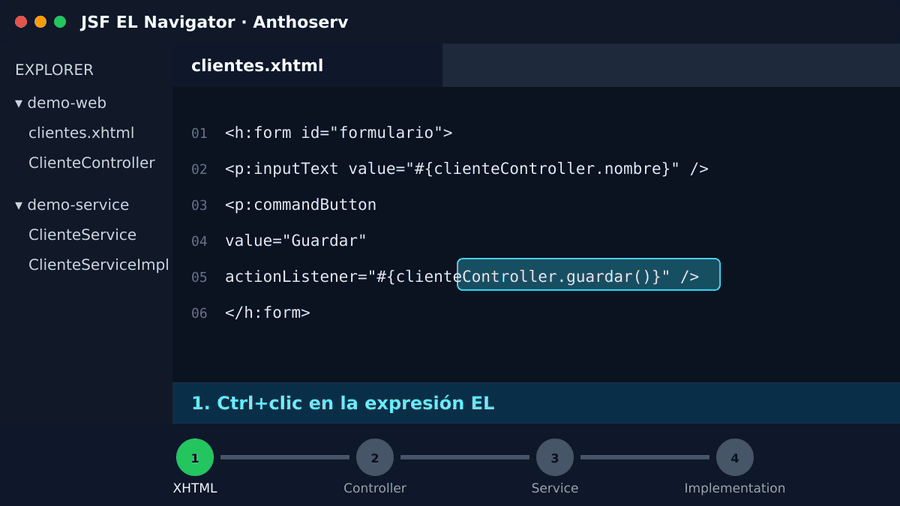

# JSF EL Navigator

[Español](README.md) · [English](README.en.md)

[](https://marketplace.visualstudio.com/items?itemName=anthoserv.jsf-el-navigator)
[](https://marketplace.visualstudio.com/items?itemName=anthoserv.jsf-el-navigator)
[](https://github.com/AnthoServ-Ship-it/jsf-el-navigator/actions/workflows/ci.yml)
[](LICENSE)

Navigate **Jakarta Faces/JSF and PrimeFaces** EL expressions from XHTML to Java,
then continue from controllers to injected services and DAOs.



## Install

Search for `JSF EL Navigator` in VS Code Extensions or run:

```bash
code --install-extension anthoserv.jsf-el-navigator
```

Open only the Maven/Gradle project or aggregator you are currently working on.
The extension does not need to index every project on your machine.

## Main workflow

Hold `Ctrl` (`Cmd` on macOS) and click, or press `F12`:

```text
view.xhtml
    #{customerController.save()}
                    ↓
CustomerController.save()
    customerService.save(name)
                    ↓
CustomerServiceImpl.save(String)
```

It works in any attribute containing EL and is not tied to a specific PrimeFaces
version:

```xhtml
<p:commandButton actionListener="#{customerController.save()}" />
<p:ajax listener="#{customerController.refresh}" />
<p:autoComplete completeMethod="#{customerController.search}" />
<p:dataTable value="#{customerController.customers}" />
```

## Features

- `F12` or `Ctrl+click` on methods, properties and chained EL expressions.
- Beans declared with `@ManagedBean`, `@Named`, `@Controller` or `@Component`.
- Method, JavaBean getter and field resolution.
- Controller → service → DAO navigation for `@EJB`, `@Inject`, `@Autowired`
  and `@Resource`, including constructor injection.
- Implementation selection when an interface has multiple candidates.
- Overload selection based on argument count and inferred types.
- Inherited methods and sibling Maven/Gradle modules.
- Hover previews, completion and diagnostics for unresolved references.
- `Shift+F12` references from Java back to XHTML and injected calls.
- Per-module in-memory index with automatic invalidation.
- Fully local processing: no telemetry and no source-code uploads.

## Try the sample

Open [examples/jsf-primefaces-demo](examples/jsf-primefaces-demo) as a VS Code
folder. It demonstrates the complete workflow:

```text
clientes.xhtml → ClienteController → ClienteServiceImpl
```

See the [sample project instructions](examples/jsf-primefaces-demo/README.md).

## Large projects

When a workspace contains many projects, different modules may declare the same
bean name. The extension finds the nearest `pom.xml`, `build.gradle` or
`build.gradle.kts` and indexes only that module's `src/main/java`.

Java service lookup remains inside the current aggregator. An explicit EJB
`lookup` wins; the extension then considers the `InterfaceImpl` convention,
qualifiers and `implements` relationships.

## Commands

Open the Command Palette with `Ctrl+Shift+P`:

- `JSF EL Navigator: Ir a la definición Java`.
- `JSF EL Navigator: Ir a la implementación del servicio`.
- `JSF EL Navigator: Reconstruir índice Java`.
- `JSF EL Navigator: Mostrar diagnóstico del índice`.

## Settings

```json
{
    "jsfElNavigator.enabled": true,
    "jsfElNavigator.javaServiceNavigation.enabled": true,
    "jsfElNavigator.diagnostics.enabled": true,
    "jsfElNavigator.logging": "info",
    "jsfElNavigator.additionalJavaSourceRoots": ["../shared-module/src/main/java"]
}
```

Additional paths can be absolute or relative to the XHTML module.

## Development

Requirements: Node.js 18.19+ and Visual Studio Code 1.85+.

```bash
npm ci
npm run validate
npm run test:integration
npm run package
```

Press `F5` to launch an Extension Development Host. Packaging creates
`jsf-el-navigator-<version>.vsix`.

## Anthoserv engineering

- Strict TypeScript, ESLint, Prettier and automated tests.
- Linux, Windows and macOS validation in GitHub Actions.
- Reproducible tag-based releases.
- Architecture: [docs/ARCHITECTURE.md](docs/ARCHITECTURE.md).
- Authoring conventions: [docs/STYLE_GUIDE.md](docs/STYLE_GUIDE.md).
- Publishing process: [docs/PUBLISHING.md](docs/PUBLISHING.md).

Use [GitHub Issues](https://github.com/AnthoServ-Ship-it/jsf-el-navigator/issues) for bugs and proposals.
See [SECURITY.md](SECURITY.md) for private security reports.

## License and author

MIT © 2026 **anthoserv**
